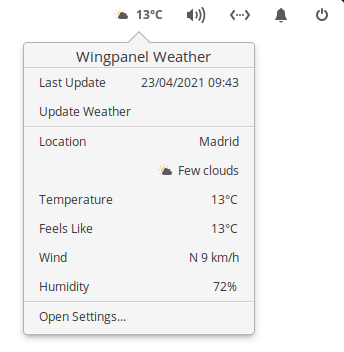
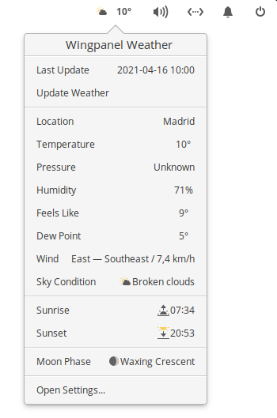
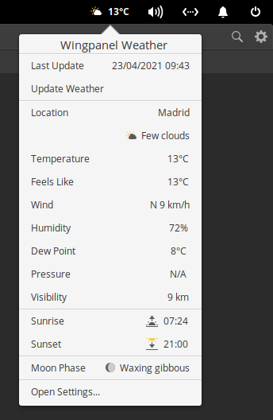
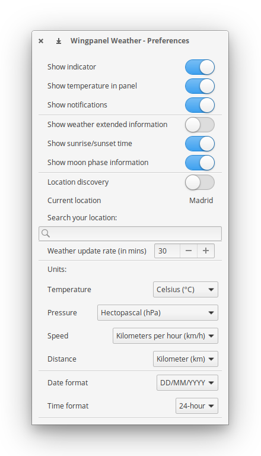

<p align="center">
  
</p>
<h1 align="center">Wingpanel Weather</h1>

## About

Wingpanel Weather is a status indicator that displays weather status information in elementary OS Wingpanel.

Being this one of my first Vala applications I'm sure that the code can be improved, so:

- If you find any problems while running the application please report it through an issue.
- Pull requests are welcome.
- Feedback and suggestions are always welcome as well.

### Features:

- Displays weather status
- Displays current temperature in the indicator
- Displays extended weather information in the popover including sunrise, sunset time and moon phase data.
- Automatically tries to discover your current location. Otherwise the current location name can be manually entered in the settings page.
- Notifys the user of important weather conditions change

### Requirements

- elementary OS 5.1.7 Hera

## Screenshots

### Indicator

### Tooltip:

### Popover (minimal view):

### Popover (full view):


### Settings:


## Building and installation from source

You'll need the following dependencies:

```
libglib2.0-dev
libgranite-dev
libgtk-3-dev
libwingpanel-2.0-dev
libgeoclue-2-dev
libgweather-3-dev
libnotify-dev
meson
valac
```

You can install them running:

```
sudo apt install libgranite-dev libgtk-3-dev libwingpanel-2.0-dev meson valac libgeoclue-2-dev libgweather-3-dev libnotify-dev
```

Run `meson` to configure the build environment and then `ninja` to build

```
meson build --prefix=/usr
cd build
ninja
```

To install, use `ninja install`

```
sudo ninja install
com.github.casasfernando.wingpanel-indicator-weather
```

## Installation using the deb package

You can also find a deb package available with every release in the releases page.
To install it you just need to download it and run:

```
sudo dpkg -i wingpanel-indicator-weather_<release>_amd64.deb
```

## Special thanks and credits
 - [Plugaru T.](https://github.com/PlugaruT/) for developing the [original project](https://github.com/PlugaruT/wingpanel-monitor).
 - Application [icon](http://iynque.deviantart.com/art/iOS-7-Icons-Updated-378969049) by [iynque (Andrew Williams)](https://www.deviantart.com/iynque)
